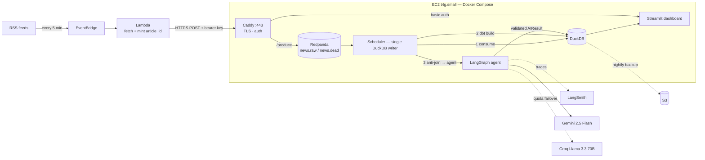
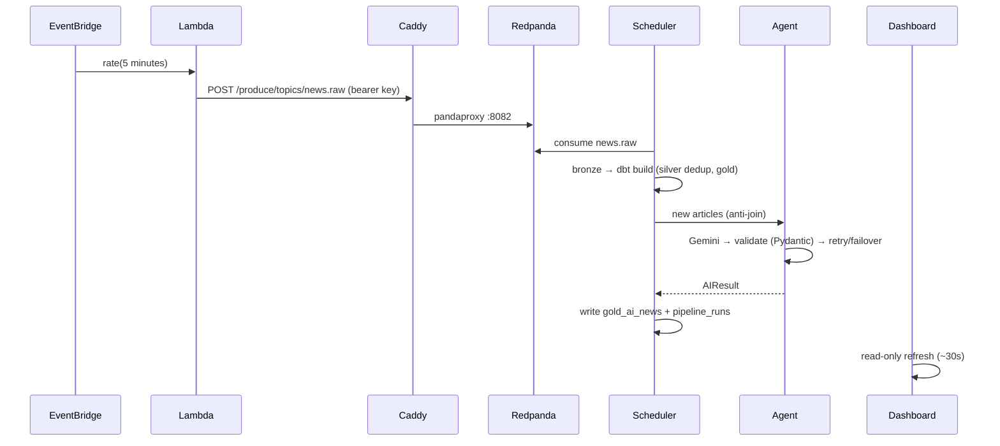

# 📰 AI-Powered News Alert System

[](https://github.com/Zia-ullah-code/news-ai-platform/actions/workflows/ci.yml)

A real-time news intelligence pipeline, end to end: **AWS Lambda** (Terraform-managed)
scrapes RSS every 5 minutes → publishes to **Redpanda** (Kafka) over an authenticated
HTTPS contract → a single-writer scheduler lands bronze data in **DuckDB** and runs
**dbt** medallion transforms → a **LangGraph** agent judges each article's importance
and summarizes it (**Gemini** primary, **Groq** failover) → alerts surface on a
**Streamlit** dashboard. Every agent run is traced in **LangSmith**.

Built to run **entirely on free tiers** — AWS Free Plan credits, Gemini/Groq/LangSmith
developer tiers, DuckDNS + Let's Encrypt — on a single t4g.small.

**Live demo:** https://zia-news.duckdns.org *(dashboard behind basic auth — credentials on request)*

## Architecture



**Data model (medallion):** `bronze_news` (append-only raw JSON) → `silver_news`
(dbt: dedup on `article_id`, normalized, tested) → `gold_news` (reading metrics) +
`gold_ai_news` (summary, importance 1–10, category, keywords, sentiment, reason).

## Design decisions worth reading

- **Lambda speaks HTTP, not Kafka.** A VPC Lambda can't reach the internet without a
  NAT gateway ($32/mo); a public Kafka listener means advertised-listener pain and an
  exposed 9092. Instead the Lambda POSTs to Redpanda's pandaproxy behind Caddy
  (TLS + bearer key). Port 9092 never faces the internet.
- **One writer, by design.** DuckDB allows a single writing process. The scheduler owns
  *all* writes and runs stages strictly in sequence (consume → dbt → AI → metrics),
  closing its connection before dbt (a subprocess) opens one. The dashboard connects
  read-only with retry.
- **Dedup before the LLM.** LLM calls are the scarcest free resource. Identity is minted
  at the producer (feed GUID → link → hash; never the title — publishers edit titles),
  silver dedups on it, and only `silver ANTI JOIN gold_ai_news` rows reach the agent.
  The anti-join doubles as a free, crash-proof work queue.
- **Quota-aware agent.** Providers rotate per attempt; a daily-quota error skips the
  provider, and when *every* provider is quota-dead the batch aborts (no futile
  retries). A per-cycle cap and a daily budget bound the worst case.
- **Config, not code paths.** Laptop and EC2 run identical containers; the only
  difference is `.env` values and a compose `edge` profile for Caddy.

## Sequence: normal flow



## Sequence: failure handling

```mermaid
sequenceDiagram
    participant S as Scheduler
    participant A as Agent
    participant G as Gemini
    participant Q as Groq
    participant RP as Redpanda

    Note over S,RP: poison message → news.dead with error context
    S->>A: article
    A->>G: attempt 1
    G-->>A: 429 RESOURCE_EXHAUSTED
    A->>Q: attempt 2 (failover)
    Q-->>A: valid AIPayload
    Note over A: both providers quota-dead → abort batch;<br/>anti-join re-queues next cycle
```

## Observability

- **LangSmith** — every agent run traced (prompt, retries, provider used), tagged by article
- **Ops dashboard page** — last-cycle age, 24h failures, AI backlog, duration/throughput charts
- **Dead-letter queue** — unparseable messages land in `news.dead` with the validation
  error, source offset, and original payload
- **Healthchecks** — scheduler heartbeat (stale >15 min = unhealthy container), Streamlit
  health endpoint, Redpanda cluster health
- **One summary log line per cycle**: `fetched=N published=N new=N ai_calls=N failures=N duration=Xs`

## Stack

| Layer | Tech |
|---|---|
| Infrastructure | Terraform → EC2 t4g.small (ARM), EIP, security group, S3, IAM, Lambda, EventBridge |
| Ingestion | AWS Lambda (python3.12/arm64) + EventBridge `rate(5 minutes)` |
| Streaming | Redpanda (Kafka API) + pandaproxy HTTP ingest |
| Storage & transforms | DuckDB + dbt (bronze → silver → gold, schema tests) |
| AI | LangGraph agent, Gemini 2.5 Flash → Groq Llama 3.3 70B failover, Pydantic-validated output |
| Serving | Streamlit behind Caddy (Let's Encrypt TLS, basic auth) on DuckDNS |
| Observability | LangSmith, CloudWatch, DLQ, Ops page, healthchecks |
| CI | GitHub Actions: ruff, pytest, dbt parse |

## Run it locally

```bash
git clone https://github.com/Zia-ullah-code/news-ai-platform && cd news-ai-platform
python3.12 -m venv .venv && source .venv/bin/activate
pip install -r requirements.txt
cp .env.example .env                       # add GEMINI_API_KEY (and friends)

docker compose up -d --build               # redpanda + scheduler + dashboard
python -m services.producer.publish        # seed real articles (Lambda's stand-in)
open http://localhost:8501
```

Deploy to AWS: see **[docs/deployment.md](docs/deployment.md)** — `terraform apply`
+ one deploy script, ~15 minutes from zero.

## Tests

```bash
ruff check . && pytest tests/ -q           # contract + storage tests
dbt build --project-dir dbt_project --profiles-dir dbt_project   # models + schema tests
```

CI runs lint, tests, and dbt parse on every push. The test suite has caught real bugs
before deploy (a DuckDB upsert limitation with list columns; quota-retry amplification).

## Repository layout

```
infra/terraform/     EC2, SG, EIP, S3, IAM, Lambda, EventBridge
services/
  ingest_lambda/     RSS → HTTPS POST (the only serverless piece)
  producer/          fetch/publish modules (shared with the Lambda)
  scheduler/         the single-writer cycle: consume → dbt → AI → metrics
  agent/             LangGraph graph, provider interface, quota handling
  dashboard/         Streamlit (read-only)
shared/              Pydantic schemas, Settings, identity minting, retry policy
dbt_project/         bronze → silver → gold models + tests
docker/              Dockerfiles, Caddyfile
docs/                design contracts, deployment guide
tests/               contract + storage tests
```

## Cost

Runs on the post-2025 **AWS Free Plan** (credit-based): ~$18/month from the $100–200
credit pool (t4g.small + IPv4 + EBS). Everything else — Redpanda, DuckDB, dbt,
LangGraph, Streamlit, Gemini/Groq/LangSmith/DuckDNS free tiers — costs $0.
`terraform destroy` tears the whole thing down cleanly.

## License

MIT — see [LICENSE](LICENSE).
